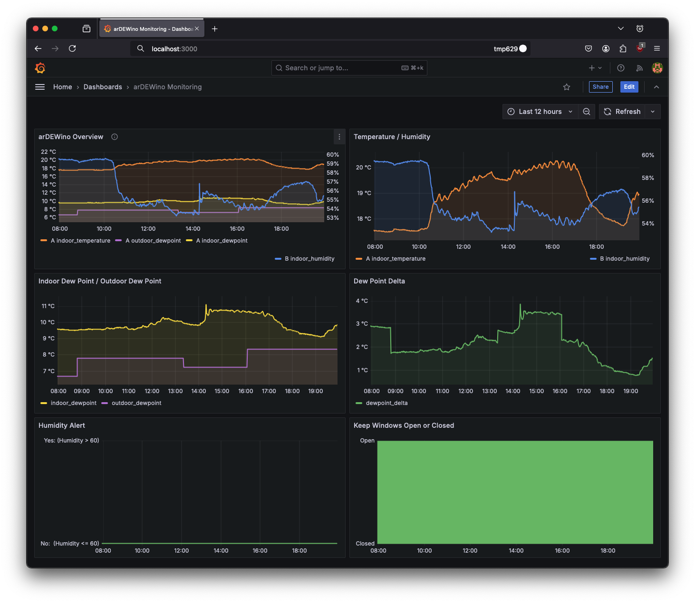
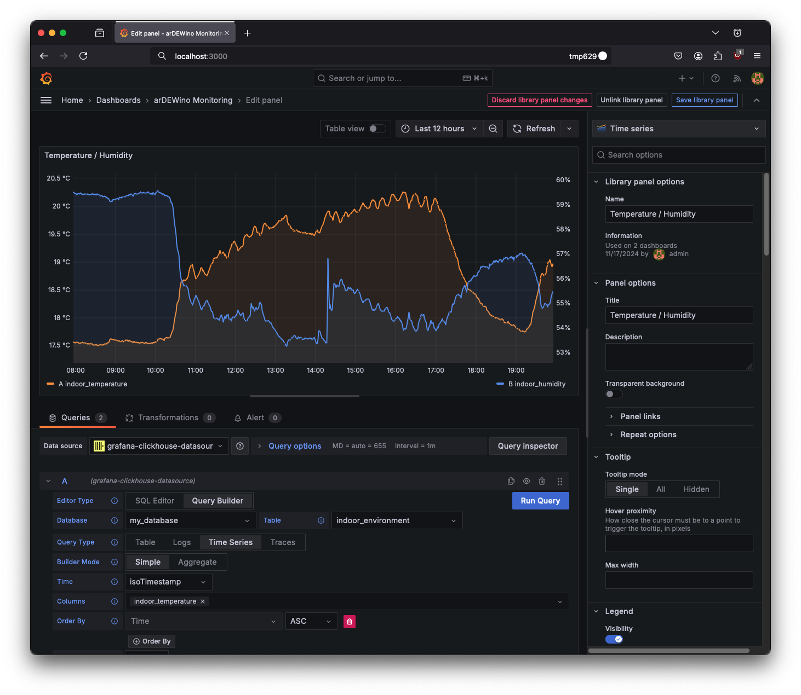
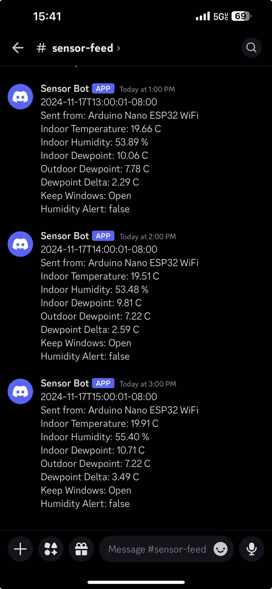

# arDEWino: An Arduino-based Dew Point Monitor
## Overview

    
    
    

arDEWino is an Arduino-based dew point monitor designed to help maintain optimal indoor humidity levels and prevent mold growth. The system utilizes an Arduino Nano ESP32 microcontroller and a SHT31 temperature and humidity sensor to measure indoor conditions. It then compares the indoor dew point to the outdoor dew point retrieved from the National Weather Service.
arDEWino can notify users when the outdoor dew point is higher than the indoor dew point, indicating that it's best to keep windows closed to prevent excess humidity from entering the home. The system can also be used for real-time temperature and humidity alerts, making it suitable for monitoring conditions for pets, instruments, or anything else sensitive to climate changes.

## Current Components/Services
* arDEWino-rs:
  * Retrieves sensor data from Arduino over WiFi/USB
* go-dew:
  * REST API that handles outdoor weather information, sending Discord notifications/alerts, and the database
* Clickhouse:
  * Columnar database optimized for analytics
* Grafana:
  * Open source interactive visualization and monitoring web app that connects to your database

## TODO
### Hardware
* Figure out alternative battery solution
  * (Anker PowerCore 5000 not working. Portable power banks shutdown if not enough current drawn) 
* Measure power consumption

### Software
CI / CD after tests are written

#### Arduino
* Power consumption logging?
* Figure out sleeps/interrupts

#### Go App
* Unit tests
* Log power usage over time

#### Rust App
* Unit tests
* Refactor for concurrency

#### Add a visualization dashboard service (e.g. Grafana)
* Graph energy consumption
* Graph sensor data
